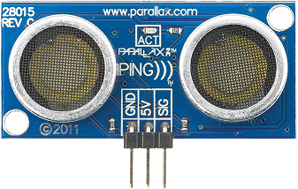

# RaspberryPing

Ce projet contient 2 classes :

- Cgpio : 
 - Cgpio(int addr) : addr = numéro de GPIO 
 - int lire() : Retourne la valeur présente sur le GPIO
 - ecrire (int value) : Ecrit value sur le GPIO

- Cping : Classe de gestion d'un capteur US Ping de Parallax
 - Cping(int gpio) : gpio = numéro du GPIO où est connecté le capteur US
 - int getDistance() : retourne la distance à un obstacle  en cm

