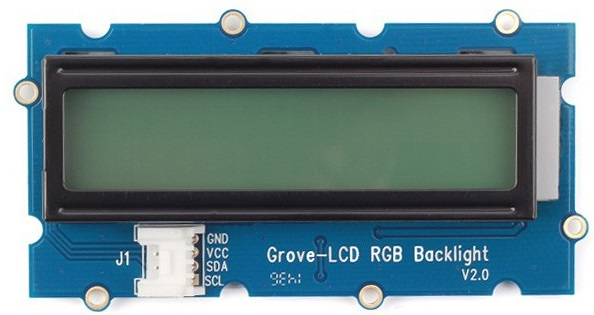

# Mesure de distance 

La mesure s'effectue au moyen d'un capteur us ping de chez Parallax et l'affichage est réalisé sur écran LCD RGB i2c 16x2 sur une Raspberry.

# L'afficheur

# le capteur us ping
# L'afficheur

